<!--
  Generated by build.py from README-TEMPLATE.j2 — do not edit README.md by hand.
  Every widget here is either a static asset committed in this repository or a
  shields.io badge reflecting real state. No third-party stats service: they
  break, and a broken supply chain on a DevSecOps profile argues against its
  owner.
-->
<p align="center">
  <picture>
    <source media="(prefers-color-scheme: dark)" srcset="assets/banner-dark.svg">
    <source media="(prefers-color-scheme: light)" srcset="assets/banner-light.svg">
    
  </picture>
</p>

<p align="center">
  <a href="https://blog.stephane-robert.info"></a>
  <a href="https://www.linkedin.com/in/stephanerobert1/"></a>
  <a href="https://github.com/stephrobert?tab=followers"></a>
  
</p>

I am **Stéphane ROBERT**, infrastructure engineer at **Outscale France**, working from Yffiniac in Brittany, France.

I spend my days hardening pipelines and my evenings writing about it. Everything I learn ends up in one of two places: a **[free tutorial on my blog](https://blog.stephane-robert.info)**, or a **lab you can actually run** from one of the repositories below. Nothing here is a demo that only works on my laptop.

---

## 🧪 dsoxlab — a CLI framework for hands-on DevSecOps labs

<p>
  <a href="https://github.com/stephrobert/dsoxlab/actions/workflows/ci.yml"></a>
  <a href="https://securityscorecards.dev/viewer/?uri=github.com/stephrobert/dsoxlab"></a>
  <a href="https://github.com/stephrobert/dsoxlab/releases/latest"></a>
  <a href="https://github.com/stephrobert/dsoxlab/stargazers"></a>
  <a href="https://github.com/stephrobert/dsoxlab/blob/main/LICENSE"></a>
</p>

**The problem:** most hands-on labs grade you on the commands you typed. Real exams — RHCSA, LFCS — grade the state of the machine, after a reboot. That gap is exactly where candidates fail.

**dsoxlab** is a domain-agnostic CLI framework driving training labs that live in their own repositories. Each catalog declares itself through a root `meta.yml` and one `lab.yaml` per lab, so adding a domain means writing a file, not patching the engine.

- **Validation proves, it does not trust.** Labs are graded on the actual state of the system with `pytest-testinfra`, including persistence after reboot.
- **Three runtimes.** A plain shell, an Incus container, or a full KVM/libvirt virtual machine — chosen per lab.
- **Progress that sticks.** Scores, hint costs and history persisted in a local SQLite database, XDG-compliant.
- **Bilingual by design.** Every user-facing string ships in English and French (`DSOXLAB_LANG=en|fr`).

```bash
git clone https://github.com/stephrobert/dsoxlab.git && cd dsoxlab
uv tool install --editable .
dsoxlab doctor          # diagnoses (and repairs) the local toolchain

git clone https://github.com/stephrobert/linux-dsoxlab-training.git && cd linux-dsoxlab-training
dsoxlab list-labs       # the active catalog is detected from the repo's meta.yml
```

<p align="center">
  <a href="https://github.com/stephrobert/dsoxlab"></a>
</p>

---

## 📝 Latest from the blog

Free, in French, and updated far more often than this README. Roughly a hundred articles and a full DevOps course live at **[blog.stephane-robert.info](https://blog.stephane-robert.info)**.

- **[Une usine logicielle sécurisée sur Incus, pas sur Kubernetes](https://blog.stephane-robert.info/post/usine-logicielle-securisee-incus/)** <sub>2026-07-06</sub>
- **[AWX n'a plus de release depuis deux ans : le risque et la solution](https://blog.stephane-robert.info/post/awx-sans-nouvelle-release-risque-et-solution/)** <sub>2026-07-03</sub>
- **[Chainguard Actions : une excellente initiative pour durcir vos GitHub Actions](https://blog.stephane-robert.info/post/chainguard-actions-plumber-securite-cicd/)** <sub>2026-07-02</sub>
- **[Incus OS : j'ai monté un cluster sans jamais ouvrir l'interface](https://blog.stephane-robert.info/post/incus-os-cluster-sans-shell/)** <sub>2026-07-01</sub>
- **[Strix : le pentester IA open-source à l'épreuve de la souveraineté](https://blog.stephane-robert.info/post/strix-pentester-ia-souverainete/)** <sub>2026-06-26</sub>

<p>
  <a href="https://blog.stephane-robert.info/post/"></a>
  <a href="https://blog.stephane-robert.info/docs/"></a>
  <a href="https://blog.stephane-robert.info/rss.xml"></a>
</p>

---

## 🔐 Supply chain & compliance tooling

- **[secure-python-pipeline](https://github.com/stephrobert/secure-python-pipeline)** <sub>`Python`</sub> — Lab : API Python avec pipeline CI/CD securise (supply chain, SLSA, SBOM, cosign)

## 🎓 Free training catalogs

Self-hosted, runnable, no signup wall.

- **[linux-dsoxlab-training](https://github.com/stephrobert/linux-dsoxlab-training)** <sub>★ 21</sub> — Linux DevSecOps training (RHCSA + LFCS) driven by the dsoxlab CLI
- **[containers-training](https://github.com/stephrobert/containers-training)** <sub>★ 159</sub> — Formation Conteneurisation Gratuite
- **[ansible-training](https://github.com/stephrobert/ansible-training)** <sub>★ 107</sub> — Une formation Ansible complète
- **[python-training](https://github.com/stephrobert/python-training)** <sub>★ 41</sub> — Une formation Python pour les Admin Sys
- **[github-actions-training](https://github.com/stephrobert/github-actions-training)** <sub>★ 5</sub> — Hands-on training repository.

## 🛠️ What I actually use

| | |
|---|---|
| **Infrastructure as code** | Terraform · OpenTofu · Pulumi · Packer · Vagrant |
| **Configuration** | Ansible · Chef / CINC · InSpec |
| **Runtime** | Kubernetes · Talos · K3s · Docker · Incus · KVM/libvirt |
| **CI/CD** | GitHub Actions · GitLab CI · Dagger |
| **Supply chain** | SLSA · SBOM · Cosign · Sigstore · Trivy · OpenSSF Scorecard · Semgrep |
| **Observability** | Prometheus · Grafana · Loki |
| **Languages** | Python · Go · Shell · HCL |
| **Cloud** | Outscale · AWS · GCP |

<details>
<summary><b>Why this page has no stats widget</b></summary>

<br>

Because the popular ones stopped working. `github-readme-stats` has been returning HTTP 503 since June 2026 and is no longer maintained; `github-profile-trophy` answers 402 and now relies on sixteen volunteer mirrors. Thousands of profiles are quietly displaying broken images right now — including, at the time of writing, its own author's.

Everything on this page is either a static SVG committed in this repository or a shields.io badge reflecting real state: a CI run, a release tag, an OpenSSF Scorecard rating. The counters at the top are computed from the GitHub API by [`build.py`](build.py) and committed by [a scheduled workflow](.github/workflows/update.yml).

On a profile about supply chain security, not hotlinking someone else's free Vercel deployment seemed like the least I could do.

</details>

<p align="center">
  <sub>Rendered by <a href="build.py"><code>build.py</code></a> from <a href="README-TEMPLATE.j2"><code>README-TEMPLATE.j2</code></a> · refreshed daily by GitHub Actions</sub>
</p>
