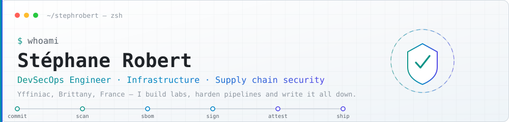

<!--
  Generated by build.py from README-TEMPLATE.j2 — do not edit README.md by hand.
  Every widget here is either a static asset committed in this repository or a
  shields.io badge reflecting real state. No third-party stats service: they
  break, and a broken supply chain on a DevSecOps profile argues against its
  owner.
-->
<p align="center">
  <picture>
    <source media="(prefers-color-scheme: dark)" srcset="assets/banner-dark.svg">
    <source media="(prefers-color-scheme: light)" srcset="assets/banner-light.svg">
    
  </picture>
</p>

<p align="center">
  <a href="https://blog.stephane-robert.info"></a>
  <a href="https://www.linkedin.com/in/stephanerobert1/"></a>
  <a href="https://github.com/stephrobert?tab=followers"></a>
  
</p>

I am **Stéphane ROBERT**, infrastructure engineer at <a href="https://github.com/linagora"> <b>LINAGORA</b></a>, working from Yffiniac in Brittany, France.

I spend my days hardening pipelines and my evenings writing about it. Everything I learn ends up in one of two places: a **[free tutorial on my blog](https://blog.stephane-robert.info)**, or a **lab you can actually run** from one of the repositories below. Nothing here is a demo that only works on my laptop.

---

## What I build

Four tools, each one because the existing answer did not hold up.

<table>
  <tr>
    <td align="center" width="44">🎭</td>
    <td><a href="https://github.com/stephrobert/feint"><b>feint</b></a></td>
    <td>the Scaleway, Outscale and Exoscale APIs, on your laptop</td>
    <td align="right"><a href="https://github.com/stephrobert/feint/stargazers"></a></td>
  </tr>
  <tr>
    <td align="center" width="44">🧪</td>
    <td><a href="https://github.com/stephrobert/dsoxlab"><b>dsoxlab</b></a></td>
    <td>hands-on DevSecOps labs that grade the machine, not your typing</td>
    <td align="right"><a href="https://github.com/stephrobert/dsoxlab/stargazers"></a></td>
  </tr>
  <tr>
    <td align="center" width="44">🛰️</td>
    <td><a href="https://github.com/stephrobert/pepin"><b>pepin</b></a></td>
    <td>three sovereign clouds, one axis</td>
    <td align="right"><a href="https://github.com/stephrobert/pepin/stargazers"></a></td>
  </tr>
  <tr>
    <td align="center" width="44">🛡️</td>
    <td><a href="https://github.com/stephrobert/pavois"><b>pavois</b></a></td>
    <td>Linux compliance that reads the running config, not the files</td>
    <td align="right"><a href="https://github.com/stephrobert/pavois/stargazers"></a></td>
  </tr>
</table>

---

### 🎭 feint — the Scaleway, Outscale and Exoscale APIs, on your laptop

<p>
  <a href="https://github.com/stephrobert/feint/actions/workflows/go.yml"></a>
  <a href="https://securityscorecards.dev/viewer/?uri=github.com/stephrobert/feint"></a>
  <a href="https://github.com/stephrobert/feint/releases/latest"></a>
  <a href="https://github.com/stephrobert/feint/stargazers"></a>
  <a href="https://github.com/stephrobert/feint/blob/main/LICENSE"></a>
</p>

**The problem:** testing cloud automation needs a real account, real credentials and a real bill. And a pipeline that needs secrets cannot run on a pull request from a fork, which is where the contributions come from.

**feint** is a local emulator of three cloud APIs. It is not a mock written against the documentation: the vendors' **own official CLIs** drive it end to end, and Terraform and OpenTofu drive two of the three. If `scw`, `osc-cli` or `exo` cannot tell the difference, neither can your automation.

- **No account, no credentials, nothing billed.** It runs offline, on a laptop, in CI, on a plane.
- **Driven by the real clients.** Conformance is proven by the vendors' CLIs, not by assertions about them.
- **Ships where you already are.** A [GitHub Action](https://github.com/stephrobert/setup-feint) and a [Homebrew tap](https://github.com/stephrobert/homebrew-feint) whose formula is derived from each release's signed checksums, never written by hand.

```bash
feint up                      # three cloud APIs, locally
scw instance server list      # the vendor's own CLI, unmodified
terraform apply               # against the emulator, nothing billed
```

---

### 🧪 dsoxlab — hands-on DevSecOps labs that grade the machine, not your typing

<p>
  <a href="https://github.com/stephrobert/dsoxlab/actions/workflows/ci.yml"></a>
  <a href="https://securityscorecards.dev/viewer/?uri=github.com/stephrobert/dsoxlab"></a>
  <a href="https://github.com/stephrobert/dsoxlab/releases/latest"></a>
  <a href="https://github.com/stephrobert/dsoxlab/stargazers"></a>
  <a href="https://github.com/stephrobert/dsoxlab/blob/main/LICENSE"></a>
</p>

**The problem:** most hands-on labs grade you on the commands you typed. Real exams, RHCSA and LFCS, grade the state of the machine, after a reboot. That gap is exactly where candidates fail.

**dsoxlab** is a domain-agnostic CLI framework driving training labs that live in their own repositories. Each catalog declares itself through a root `meta.yml` and one `lab.yaml` per lab, so adding a domain means writing a file, not patching the engine.

- **Validation proves, it does not trust.** Labs are graded on the actual state of the system with `pytest-testinfra`, including persistence after reboot.
- **Three runtimes.** A plain shell, an Incus container, or a full KVM/libvirt virtual machine, chosen per lab.
- **Progress that sticks.** Scores, hint costs and history persisted in a local SQLite database, XDG-compliant.
- **Bilingual by design.** Every user-facing string ships in English and French (`DSOXLAB_LANG=en|fr`).

```bash
uv tool install dsoxlab
dsoxlab doctor                # diagnoses (and repairs) the local toolchain
dsoxlab list-labs             # the catalog is detected from the repo's meta.yml
```

<p align="center">
  <a href="https://github.com/stephrobert/dsoxlab"></a>
</p>

---

### 🛰️ pepin — three sovereign clouds, one axis

<p>
  <a href="https://github.com/stephrobert/pepin/actions/workflows/ci.yml"></a>
  <a href="https://securityscorecards.dev/viewer/?uri=github.com/stephrobert/pepin"></a>
  <a href="https://github.com/stephrobert/pepin/releases/latest"></a>
  <a href="https://github.com/stephrobert/pepin/stargazers"></a>
  <a href="https://github.com/stephrobert/pepin/blob/main/LICENSE"></a>
</p>

**The problem:** every provider ships its own posture dashboard, so three clouds means three scores that cannot be compared, and a question nobody can answer: which of them is actually the worst?

**pepin** evaluates Outscale, Scaleway and Exoscale against **one** baseline, anchored on SCSL, SecNumCloud, CIS and ISO. One axis, three clouds, so the comparison means something.

- **Before it is provisioned, not after it is billed.** It reads a Terraform plan, so a misconfiguration is caught at review time.
- **Sovereign by construction.** No dependency on a US-hosted control plane to tell you how your European cloud is doing.
- **One baseline, not a crosswalk.** A control is mapped to the texts it really cites, and never invented to fill a table.

```bash
pepin scan --provider outscale        # posture of a live account
pepin scan --tf plan.json             # or of a plan, before apply
```

---

### 🛡️ pavois — Linux compliance that reads the running config, not the files

<p>
  <a href="https://github.com/stephrobert/pavois/actions/workflows/go.yml"></a>
  <a href="https://securityscorecards.dev/viewer/?uri=github.com/stephrobert/pavois"></a>
  <a href="https://github.com/stephrobert/pavois/releases/latest"></a>
  <a href="https://github.com/stephrobert/pavois/stargazers"></a>
  <a href="https://github.com/stephrobert/pavois/blob/main/LICENSE"></a>
</p>

**The problem:** `/etc/ssh/sshd_config` can say `PermitRootLogin no` while a drop-in read later sets it to `yes`. Every file-based scanner reports the host compliant. The machine accepts root over SSH.

**pavois** asks the service instead of reading its files: `sshd -T`, `sysctl`, `systemctl show`, `auditctl -l`. The **effective** configuration, which is the only one an attacker meets. 789 controls across 9 Linux targets, graded A to E over CIS, ANSSI-BP-028, NIST, PCI-DSS and DISA STIG.

- **It hardens, and proves it.** `harden apply --reboot` compares the kernel `boot_id` before and after, so a setting that only holds until the next boot cannot pass silently.
- **Evidence you can hand to an auditor.** A campaign packages into a tamper-evident bundle you sign under your own identity; pavois never holds a key.
- **Proven, not asserted.** Debian 12 and 13 go through the full campaign on fresh VMs, and the run itself is validated: a control that returned a verdict it never measured fails the campaign.

```bash
pavois scan local --sudo              # grade this host, A to E
pavois harden plan admin@server1      # a reviewable plan, nothing applied
pavois bundle before.json after.json  # signable evidence
```

---

## 📝 Latest from the blog

Free, in French, and updated far more often than this README. Roughly a hundred articles and a full DevOps course live at **[blog.stephane-robert.info](https://blog.stephane-robert.info)**.

- **[Une roadmap publique pour maintenir mes formations avec vous](https://blog.stephane-robert.info/post/roadmap-publique-maintenir-formations/)** <sub>2026-09-17</sub>
- **[Chainguard Actions : une excellente initiative pour durcir vos GitHub Actions](https://blog.stephane-robert.info/post/chainguard-actions-plumber-securite-cicd/)** <sub>2026-07-28</sub>
- **[npm ne lance plus les scripts d'installation : pnpm l'avait fait avant](https://blog.stephane-robert.info/post/npm-scripts-installation-desactives/)** <sub>2026-07-28</sub>
- **[Quand vos dépôts GitHub deviennent l'infrastructure d'attaque d'un autre](https://blog.stephane-robert.info/post/github-actions-infrastructure-attaque-cpanel/)** <sub>2026-07-23</sub>
- **[Mes extensions Visual Studio Code préférées pour le DevOps](https://blog.stephane-robert.info/post/vscode-favorite-extensions/)** <sub>2026-07-23</sub>

<p>
  <a href="https://blog.stephane-robert.info/post/"></a>
  <a href="https://blog.stephane-robert.info/docs/"></a>
  <a href="https://blog.stephane-robert.info/rss.xml"></a>
</p>

---

## 🔐 Supply chain & compliance tooling

- **[scankit](https://github.com/stephrobert/scankit)** <sub>`Go`</sub> — Shared Go library: terminal presentation, SARIF, findings and A-E scoring for security tooling
- **[secure-python-pipeline](https://github.com/stephrobert/secure-python-pipeline)** <sub>`Python`</sub> <sub>★ 2</sub> — Lab : API Python avec pipeline CI/CD securise (supply chain, SLSA, SBOM, cosign)

## 🎓 Free training catalogs

Self-hosted, runnable, no signup wall.

- **[linux-dsoxlab-training](https://github.com/stephrobert/linux-dsoxlab-training)** <sub>★ 38</sub> — Linux DevSecOps training (RHCSA + LFCS) driven by the dsoxlab CLI
- **[kubernetes-dsoxlab-training](https://github.com/stephrobert/kubernetes-dsoxlab-training)** <sub>★ 4</sub> — Labs Kubernetes vérifiables pour CKA, CKAD et CKS, sur un cluster kubeadm vanilla. Pilotés par la CLI dsoxlab.
- **[containers-training](https://github.com/stephrobert/containers-training)** <sub>★ 167</sub> — Formation Conteneurisation Gratuite
- **[ansible-training](https://github.com/stephrobert/ansible-training)** <sub>★ 118</sub> — Une formation Ansible complète
- **[python-training](https://github.com/stephrobert/python-training)** <sub>★ 42</sub> — Une formation Python pour les Admin Sys
- **[github-actions-training](https://github.com/stephrobert/github-actions-training)** <sub>★ 6</sub> — Hands-on training repository.

## 🛠️ What I actually use

<table>
  <tr><td><b>Infrastructure as code</b></td><td>Terraform · OpenTofu · Pulumi · Packer · Vagrant</td></tr>
  <tr><td><b>Configuration</b></td><td>Ansible · Chef / CINC · InSpec</td></tr>
  <tr><td><b>Runtime</b></td><td>Kubernetes · Talos · K3s · Docker · Incus · KVM/libvirt</td></tr>
  <tr><td><b>CI/CD</b></td><td>GitHub Actions · GitLab CI · Dagger</td></tr>
  <tr><td><b>Supply chain</b></td><td>SLSA · SBOM · Cosign · Sigstore · Trivy · OpenSSF Scorecard · Semgrep</td></tr>
  <tr><td><b>Observability</b></td><td>Prometheus · Grafana · Loki</td></tr>
  <tr><td><b>Languages</b></td><td>Python · Go · Shell · HCL</td></tr>
  <tr><td><b>Cloud</b></td><td>Scaleway · Outscale · Exoscale · AWS · GCP</td></tr>
</table>

<details>
<summary><b>Why this page has no stats widget</b></summary>

<br>

Because the popular ones stopped working. `github-readme-stats` has been returning HTTP 503 since June 2026 and is no longer maintained; `github-profile-trophy` answers 402 and now relies on sixteen volunteer mirrors. Thousands of profiles are quietly displaying broken images right now — including, at the time of writing, its own author's.

Everything on this page is either a static SVG committed in this repository or a shields.io badge reflecting real state: a CI run, a release tag, an OpenSSF Scorecard rating. The counters at the top are computed from the GitHub API by [`build.py`](build.py) and committed by [a scheduled workflow](.github/workflows/update.yml).

On a profile about supply chain security, not hotlinking someone else's free Vercel deployment seemed like the least I could do.

</details>

<p align="center">
  <sub>Rendered by <a href="build.py"><code>build.py</code></a> from <a href="README-TEMPLATE.j2"><code>README-TEMPLATE.j2</code></a> · refreshed daily by GitHub Actions</sub>
</p>
